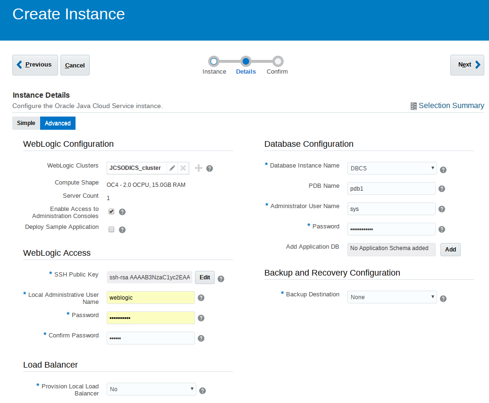

# ODI on JCS Install and Config Notes

Derrick Cameron
Mar 8, 2019

This are some notes to help you through the installation and configuration of ODI on JCS.  This requires a database.  It was tested on 12.1, but should work on 12.2 (Classic and OCI).  There are some differences when using DB Classic versus OCI, but this is just in the beginning.  

### **Create a DBCS Service (Classic or OCI)**

Not documented, but straightforward.  Be sure to select backup.

If the Database is on OCI or ADW/ATP you need to create the following policies.

OCI: 

```
Allow service PSM to inspect database-family in compartment <compartment_name>
Allow service PSM to inspect database-family in compartment <compartment_name>
Allow service PSM to inspect vcns in compartment <compartment_name>
Allow service PSM to use subnets in compartment <compartment_name>
Allow service PSM to use vnics in compartment <compartment_name>
Allow service PSM to manage security-lists in compartment <compartment_name>
Allow service PSM to manage all-resources in compartment <compartment_name>

Click on button “Create” at the bottom of the screen
```

ADW: 

`Allow service PSM to inspect autonomous-database in compartment <compartment_name>`

### **Create JCS**

If using DB on OCI, first apply [this patch](https://support.oracle.com/epmos/faces/DocContentDisplay?_afrLoop=500232808913353&id=2434657.1&_afrWindowMode=0&_adf.ctrl-state=1p33fhsy9_9) to JCS.

**Be sure to select the availability domain if the DB is on OCI**



You should see something similar to this:

```
Jan 17, 2019 10:32:59 PM UTC	Activity Submitted
Jan 17, 2019 10:33:03 PM UTC	Activity Started
Jan 17, 2019 10:33:05 PM UTC	Started operation to create service [JCSODICS] in identity domain [idcs-a8db2211d48045aa9bbc9f93fe2475bf].
Jan 17, 2019 10:33:06 PM UTC	Creating resources [jcsodics-wls-1] for service [JCSODICS].
Jan 17, 2019 10:39:14 PM UTC	Completed creating service [JCSODICS] resources in domain [idcs-a8db2211d48045aa9bbc9f93fe2475bf].
Jan 17, 2019 10:41:27 PM UTC	Started operation to check provisioning status on the VMs for [WLS]
Jan 17, 2019 10:49:57 PM UTC	Provisioning Succeeded on host(s): jcsodics-wls-1
Jan 17, 2019 10:49:57 PM UTC	Provisioning of component [WLS] succeeded.
Jan 17, 2019 10:50:40 PM UTC	Activity Ended
```


https://go.oracle.com/adwc


