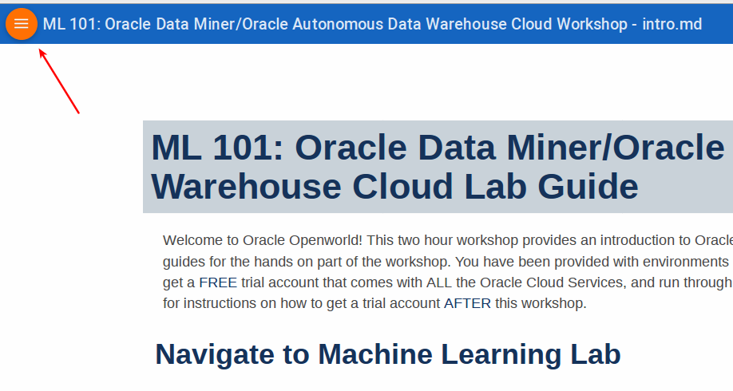
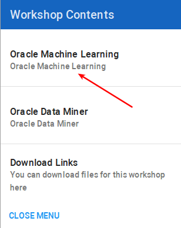

# ODI on JCS Install and Config Notes

Derrick Cameron
Mar 8, 2019

This are some notes to help you through the installation and configuration of ODI on JCS.  This requires a database.  It was tested on 12.1, but should work on 12.2 (Classic and OCI).  There are some differences when using DB Classic versus OCI, but this is just in the beginning.  

### **Create a DBCS Service (Classic or OCI)**

If the Database is on OCI or ADW/ATP you need to create the following policies.

OCI: 

```
Allow service PSM to inspect database-family in compartment compartment_name
Allow service PSM to inspect database-family in compartment compartment_name
Allow service PSM to inspect vcns in compartment <compartment_name>
Allow service PSM to use subnets in compartment <compartment_name>
Allow service PSM to use vnics in compartment <compartment_name>
Allow service PSM to manage security-lists in compartment <compartment_name>
Allow service PSM to manage all-resources in compartment <compartment_name>
Click on button “Create” at the bottom of the screen
```

ADW: 

`Allow service PSM to inspect autonomous-database in compartment compartment_name`



 

## Acquire an Oracle Cloud Trial or Workshop Account (after this workshop)

Please click on the [Free Oracle Cloud Promotion](https://myservices.us.oraclecloud.com/mycloud/signup?language=en&sourceType=:ex:tb:::RC_NAMK180723P00029:RedshiftADWC_HOL&SC=:ex:tb:::RC_NAMK180723P00029:RedshiftADWC_HOL&pcode=NAMK180723P00029) link to complete all the required steps to get your free Oracle Cloud Trial Account. When you complete the registration process you'll receive a $300 credit and up to 3500 hours of free Oracle Cloud usage. You'll have 1000s of hours left over after the labs to continue to explore the Oracle Cloud.  Soon after requesting your trial you will receive the following email. You will not be able to start Lab 100 until you have received it.


**Suggested followup Autonomous Data Warehouse Workshop, with Oracle Machine Learning:**

https://go.oracle.com/adwc


